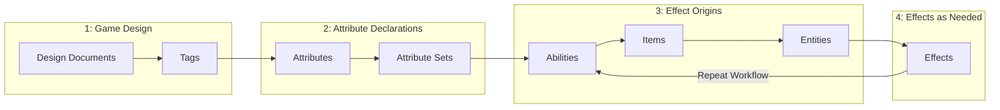

# Asset Workflow

Recommended workflow for creating and organizing PlayForge assets.

## Creation Order

Create assets in this order to minimize dependency issues:



### 1. Game Design

Define your tag hierarchy first—everything else depends on it:

```
Status/
├── Alive
├── Dead
├── Burning
└── Stunned

Entity/
├── Player
├── Enemy
└── NPC
```

### 2. Attribute Declarations

Create your attribute model:

```yaml
# Core stats
Attr_Health
Attr_Mana
Attr_Strength
Attr_Intelligence
Attr_AttackDamage
```

Next, create your attribute set(s):

```yaml
AttrSet_PlayerVitals:
  - Health: 100
  - Defense: 24
  - Mana: 80
```

### 3. Effect Origins

Abilities and items are both effect origins. In this stage, create new assets and supplement with new effects as needed.

Build effect library (damage, buffs, costs, cooldowns):

```yaml
Ability_Fireball:
  Cost: Effect_Cost_Mana30
  Cooldown: Effect_Cooldown_5s
  Stage 0:
    Task 0:
      Type: ApplyEffects
```

```yaml
Item_StrengthGauntlets:
  Cost: Effect_Cost_Mana30
  Cooldown: Effect_Cooldown_5s
  Effects: [Effect_Damage_Fire]
```

### 4. Effects as Needed

Continue to create effects to configure your effect origins.

```yaml

Effect_Damage_Fire
Effect_Buff_AttackUp
Effect_Cost_Mana30
Effect_Cooldown_5s
```

### 6. Items

Create equipment and consumables:

```yaml
Item_Sword_Fire:
  Passive Effects: [Effect_Buff_FireDamage]
  Abilities: [Ability_FlameStrike]
```

### 7. Entities

Finally, create complete characters:

```yaml
Entity_Player:
  Attribute Set: AttrSet_PlayerVitals
  Abilities: [Ability_BasicAttack, Ability_Fireball]
```

## Folder Structure

Recommended organization:

```
Assets/Data/PlayForge/
├── Abilities/
│   ├── Player/
│   └── Enemy/
├── Attributes/
├── AttributeSets/
├── Effects/
│   ├── Damage/
│   ├── Buffs/
│   ├── Costs/
│   └── Cooldowns/
├── Entities/
├── Items/
└── Tags/
```

## Naming Conventions

| Asset Type | Pattern | Example |
|------------|---------|---------|
| Ability | `Ability_[Name]` | `Ability_Fireball` |
| Effect | `Effect_[Type]_[Name]` | `Effect_Damage_Fire` |
| Attribute | `Attr_[Name]` | `Attr_MaxHealth` |
| AttributeSet | `AttrSet_[Category]` | `AttrSet_PlayerVitals` |
| Entity | `Entity_[Name]` | `Entity_Goblin` |
| Item | `Item_[Type]_[Name]` | `Item_Weapon_Sword` |
| Tag | `Tag_[Category]_[Name]` | `Tag_Status_Burning` |

## Creating Assets

### Via Forge (Recommended)

1. **Window → PlayForge → Manager**
2. **Create** tab
3. Select type, enter name, choose template
4. Click **Create**

### Via Unity Menu

```
Right-click → Create → PlayForge → [Asset Type]
```

### Via Code

```csharp
var ability = ScriptableObject.CreateInstance<Ability>();
AssetDatabase.CreateAsset(ability, "Assets/Data/Abilities/NewAbility.asset");
```

## Templates

### Setting Up

1. Create and configure an asset as desired
2. **Forge Manager → Settings → Assets**
3. Select asset type tab
4. Drag asset to Templates section
5. (Optional) Mark as default (★) or add tag

### Using Templates

- Select template in Create tab dropdown
- Default templates are used by default
- Import button (↓) in inspector header

## Importing

Copy configuration from another asset:

1. Select target asset in Inspector
2. Click **↓** (Import) in header
3. Choose template or browse assets
4. Confirm import

**Imported:** All configuration except Name, Description, Icon

## Validation

Check for common issues:

1. **Forge Manager → Settings → Assets**
2. Click **Validate All Assets**

Checks for:

- Missing display names
- Abilities without cost/cooldown
- Effects without workers
- Empty attribute sets

## Best Practices

| Do | Don't |
|----|-------|
| Create Tags first | Reference missing assets |
| Use consistent naming | Mix naming conventions |
| Organize in folders | Dump everything in root |
| Use templates | Reconfigure from scratch |
| Validate regularly | Ship unchecked assets |