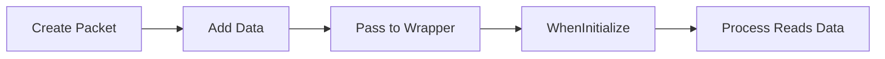
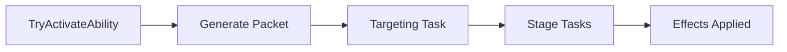

# Data Packets

**Data Packets** carry contextual information through processes and abilities. They're tag-keyed dictionaries that pass position, rotation, targets, and custom data between systems.

## Overview

| Packet | Use Case |
|--------|----------|
| `ProcessDataPacket` | MonoProcess initialization and runtime |
| `AbilityDataPacket` | Ability execution with effect origin context |

## ProcessDataPacket

Base packet for MonoProcess data. Stores values keyed by Tags.

### Structure

```csharp
public class ProcessDataPacket
{
    protected Dictionary<Tag, List<object>> Payload;
    public IGameplayProcessHandler Handler;
}
```

Each Tag key maps to a **list** of values—multiple values can exist under one key.

### Factory Methods

```csharp
// GameRoot as parent transform
var data = ProcessDataPacket.RootDefault();

// GameRoot as parent only if not already in hierarchy
var data = ProcessDataPacket.RootLocal(myMonoBehaviour);

// Copy transform data from source object
var data = ProcessDataPacket.LocalDefault(myMonoBehaviour);
// Adds: POSITION, ROTATION, PARENT_TRANSFORM
```

### Adding Data

```csharp
data.AddPayload(Tags.POSITION, transform.position);
data.AddPayload(Tags.TARGET_REAL, enemy);

// Multiple values under same key
data.AddPayload(Tags.TARGET_REAL, enemy1);
data.AddPayload(Tags.TARGET_REAL, enemy2);
```

### Retrieving Data

```csharp
// Single value with target policy
if (data.TryGet<Vector3>(Tags.POSITION, EProxyDataValueTarget.Primary, out var pos))
{
    transform.position = pos;
}

// First value of type
if (data.TryGetFirst<ITarget>(Tags.TARGET_REAL, out var target))
{
    // Use target
}

// All values as DataValue wrapper
if (data.TryGet<ITarget>(Tags.TARGET_REAL, out DataValue<ITarget> targets))
{
    var primary = targets.Primary;
    var all = targets.All;
    var random = targets.Any;
}
```

### Value Target Policies

| Policy | Returns |
|--------|---------|
| `Primary` | First value added |
| `Any` | Random value |
| `Last` | Most recent value |

## AbilityDataPacket

Extends ProcessDataPacket with ability-specific context.

### Structure

```csharp
public class AbilityDataPacket : ProcessDataPacket
{
    public IEffectOrigin Spec;  // AbilitySpec or source derivation
}
```

### Creation

```csharp
// From ability spec
var data = AbilityDataPacket.GenerateFrom(abilitySpec, useImplicitTargeting: true);

// Root fallback (uses GameRoot)
var data = AbilityDataPacket.GenerateRoot();
```

When `useImplicitTargeting` is true, the owner is added as `TARGET_REAL` in the `Primary` position  `.

### Helper Methods

```csharp
// Get target with policy
if (data.TryGetTarget(EProxyDataValueTarget.Primary, out var target))
{
    target.ApplyGameplayEffect(spec);
}

// Get first target (common pattern)
if (data.TryGetFirstTarget(out var target))
{
    // Apply effects
}
```

## Standard Tags

### Initialization Tags

| Tag | Type | Purpose |
|-----|------|---------|
| `PARENT_TRANSFORM` | Transform | Parent for instantiated object |
| `POSITION` | Vector3, Transform, or IGameplayAbilitySystem | Spawn position |
| `ROTATION` | Quaternion, Transform, or IGameplayAbilitySystem | Spawn rotation |

### Ability Tags

| Tag | Type | Purpose |
|-----|------|---------|
| `SOURCE` | ISource | Effect/ability source |
| `TARGET_REAL` | ITarget | Target entity |
| `TARGET_POS` | Vector3 | Target position |
| `DERIVATION` | IEffectOrigin | Spec for effect generation |

## Pipeline Flow

### MonoProcess Flow



```csharp
// 1. Create packet
var data = ProcessDataPacket.RootDefault();
data.AddPayload(Tags.POSITION, spawnPoint);
data.AddPayload(Tags.TARGET_REAL, enemy);

// 2. Create process
var wrapper = ProcessControl.CreateProcess(projectilePrefab, data);

// 3. Process reads in WhenInitialize
public override void WhenInitialize(ProcessRelay relay)
{
    base.WhenInitialize(relay);  // Handles POSITION, ROTATION, PARENT_TRANSFORM
    
    regData.TryGet(Tags.TARGET_REAL, EProxyDataValueTarget.Primary, out target);
}
```

### Ability Flow



```csharp
// Packet flows through entire ability execution
public override async UniTask Activate(AbilityDataPacket data, CancellationToken token)
{
    // Read data added by previous tasks
    if (!data.TryGetFirstTarget(out var target)) return;
    
    // Add data for subsequent tasks
    data.AddPayload(Tags.TARGET_POS, target.AsTransform().position);
    
    // Apply effects using packet's spec
    foreach (var effect in Effects)
    {
        var spec = data.Spec.GetOwner().GenerateEffectSpec(data.Spec, effect);
        target.ApplyGameplayEffect(spec);
    }
}
```

## Common Patterns

### Targeting Task → Effect Task

```csharp
// Targeting task adds target
public class SelectTargetTask : AbstractTargetingAbilityTask
{
    public override async UniTask Activate(AbilityDataPacket data, CancellationToken token)
    {
        var target = await WaitForTargetSelection(token);
        data.AddPayload(Tags.TARGET_REAL, target);
    }
}

// Effect task reads target
public class ApplyDamageTask : AbstractAbilityTask
{
    public override async UniTask Activate(AbilityDataPacket data, CancellationToken token)
    {
        if (data.TryGetFirstTarget(out var target))
        {
            target.ApplyGameplayEffect(
                data.Spec.GetOwner().GenerateEffectSpec(data.Spec, damageEffect)
            );
        }
    }
}
```

### Spawning Projectile from Ability

```csharp
public override async UniTask Activate(AbilityDataPacket data, CancellationToken token)
{
    // Create process packet from ability packet
    var processData = ProcessDataPacket.RootDefault(data.Handler);
    
    // Forward relevant data
    processData.AddPayload(Tags.POSITION, data.Spec.GetOwner().AsTransform().position);
    processData.AddPayload(Tags.DERIVATION, data.Spec);
    
    if (data.TryGetFirstTarget(out var target))
        processData.AddPayload(Tags.TARGET_REAL, target);
    
    ProcessControl.CreateProcess(projectilePrefab, processData);
}
```

## Tips for Clarity

### 1. Define Custom Tags for Your Data

Don't overload standard tags. Create specific tags:

```csharp
public static partial class Tags
{
    // Projectile-specific
    public static Tag PROJECTILE_SPEED => Tag.Generate("ProjectileSpeed");
    public static Tag PROJECTILE_PIERCE => Tag.Generate("ProjectilePierce");
    
    // Combat-specific  
    public static Tag CRIT_MULTIPLIER => Tag.Generate("CritMultiplier");
    public static Tag DAMAGE_TYPE => Tag.Generate("DamageType");
}
```

### 2. Create Typed Accessors

Wrap common access patterns:

```csharp
public static class AbilityDataExtensions
{
    public static bool TryGetDamageType(this AbilityDataPacket data, out DamageType type)
    {
        return data.TryGetFirst(Tags.DAMAGE_TYPE, out type);
    }
    
    public static float GetProjectileSpeed(this ProcessDataPacket data, float fallback = 10f)
    {
        return data.Get(Tags.PROJECTILE_SPEED, EProxyDataValueTarget.Primary, fallback);
    }
}
```

### 3. Document Expected Data Per Task

```csharp
/// <summary>
/// Reads: TARGET_REAL (ITarget)
/// Writes: Nothing
/// Requires: At least one target
/// </summary>
public class ApplyEffectsTask : AbstractAbilityTask { }
```

### 4. Validate Early

```csharp
public override async UniTask Activate(AbilityDataPacket data, CancellationToken token)
{
    // Fail fast if required data missing
    if (!data.TryGetFirstTarget(out var target))
    {
        Debug.LogWarning($"{GetType().Name}: No target in packet");
        return;
    }
    
    // Proceed with valid data
}
```

### 5. Use DataValue for Multi-Target

```csharp
// Instead of multiple TryGet calls
if (data.TryGet<ITarget>(Tags.TARGET_REAL, out DataValue<ITarget> targets))
{
    foreach (var target in targets.All)
    {
        ApplyEffect(target);
    }
}
```

## Debugging

Log packet contents:

```csharp
public static void LogPacket(this ProcessDataPacket data, string context)
{
    Debug.Log($"[{context}] Packet contents:");
    // Note: Payload is protected, so add this method to ProcessDataPacket
    // or expose a debug method
}
```

Check for missing data:

```csharp
if (!data.TryGetFirstTarget(out var target))
{
    Debug.LogError($"Task {GetType().Name} expected TARGET_REAL but none found");
    return;
}
```
