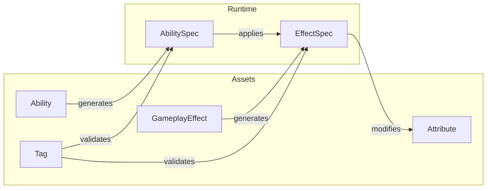

# Core Concepts

Understanding these fundamental concepts is essential for working effectively with PlayForge.

## System Overview



## The Spec Pattern

PlayForge uses a consistent **Asset → Spec** pattern:

| Asset (Template) | Spec (Runtime Instance) |
|------------------|------------------------|
| `Ability` | `AbilitySpec` |
| `GameplayEffect` | `GameplayEffectSpec` |

**Assets** are ScriptableObjects defined in the editor.  
**Specs** are runtime instances with context (owner, level, target).

## Building Blocks

<div class="feature-grid" markdown>

<div class="feature-card" markdown>
### [Tags](tags.md)
Hierarchical identifiers for categorization and requirements. The foundation for conditional logic.
</div>

<div class="feature-card" markdown>
### [Attributes](attributes.md)
Numeric values like Health, Mana, Attack. Support base/current values and derivations.
</div>

<div class="feature-card" markdown>
### [Effects](effects.md)
Modify attributes and grant tags. Instant, durational, or infinite with stacking support.
</div>

<div class="feature-card" markdown>
### [Abilities](abilities.md)
Interactive actions with costs, cooldowns, and multi-stage execution.
</div>

<div class="feature-card" markdown>
### [Entities](entities.md)
Complete character definitions with attributes, abilities, and tags.
</div>

<div class="feature-card" markdown>
### [Items](items.md)
Equipment and consumables that provide effects and abilities.
</div>

<div class="feature-card" markdown>
### [Workers](workers.md)
Extend behavior with custom logic for effects, attributes, and entities.
</div>

</div>

## Core Interfaces

```csharp
// Entity that can apply effects and activate abilities
public interface ISource : ITarget
{
    List<Tag> GetAffiliation();
    GameplayEffectSpec GenerateEffectSpec(IEffectOrigin origin, GameplayEffect effect);
}

// Entity that can receive effects
public interface ITarget
{
    AbilitySystemComponent AsGAS();
    List<Tag> GetAppliedTags();
    void ApplyGameplayEffect(GameplayEffectSpec spec);
}
```

## Recommended Reading Order

1. **[Tags](tags.md)** — Foundation for requirements
2. **[Attributes](attributes.md)** — Entity stats
3. **[Effects](effects.md)** — Modify attributes
4. **[Abilities](abilities.md)** — Interactive actions
5. **[Entities](entities.md)** — Complete characters
6. **[Items](items.md)** — Equipment system
7. **[Workers](workers.md)** — Custom behavior
