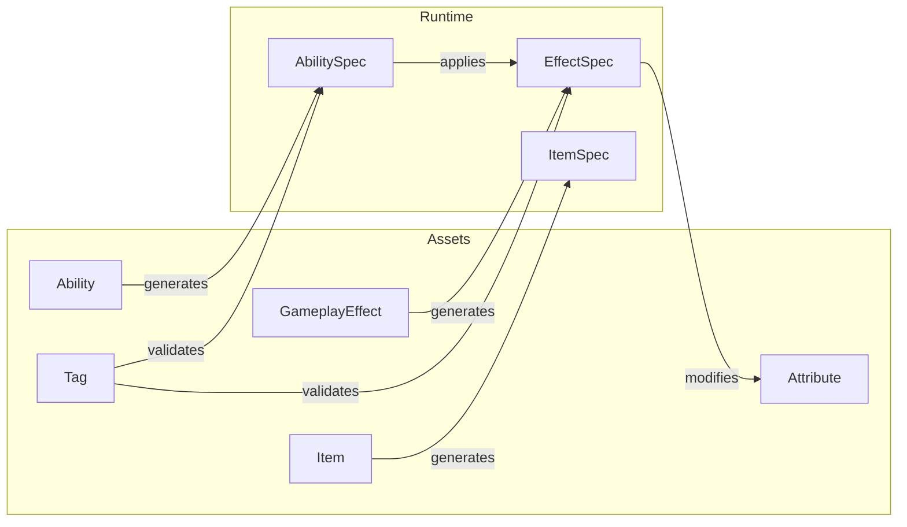

# Core Concepts

Understanding these fundamental concepts is essential for working effectively with PlayForge.

## The Forge

A powerful custom editor suite for efficient, informed, and reliable game development.

| Forge Tab | Description                                  |
|-----------|----------------------------------------------|
| Create    | Create new assets                            |
| View      | Project-wide view of assets & asset values   |
| Analysis  | Compare power balance between assets         |
| Settings  | Set asset templates, save paths, and more... |

### Forge Tutorial

For more information on using the Forge, including tips and optimizations, see the video below:

<iframe width="560" height="315" src="https://www.youtube.com/embed/iqMXaDi10NQ?si=uvcrHPVnSZpYZB-9" title="YouTube video player" frameborder="0" allow="accelerometer; autoplay; clipboard-write; encrypted-media; gyroscope; picture-in-picture; web-share" referrerpolicy="strict-origin-when-cross-origin" allowfullscreen></iframe>

## System Overview



## The Spec Pattern

PlayForge uses a consistent **Asset → Spec** pattern:

| Asset (Template) | Spec (Runtime Instance)  | Spec References                         |
|------------------|--------------------------|-----------------------------------------|
| `Ability`        | `AbilitySpec`            | Owner & level                           |
| `GameplayEffect` | `GameplayEffectSpec`     | Origin, owner, target, & tracked impact |
| `Item`           | `ItemSpec`               | Owner, level                            |

**Assets** are ScriptableObjects defined in the editor.  
**Specs** are runtime instances with context (owner, level, target).

## PlayForge Building Blocks

<div class="feature-grid" markdown>

<div class="feature-card" markdown>
### [Tags](tags.md)
Hierarchical identifiers for categorization and requirements. The foundation for conditional logic.
</div>

<div class="feature-card" markdown>
### [Attributes](attributes.md)
Numeric values like Health, Mana, Attack. Support base/current values and derivations.
</div>

<div class="feature-card" markdown>
### [Effects](effects.md)
Modify attributes and grant tags. Instant, durational, or infinite with stacking support.
</div>

<div class="feature-card" markdown>
### [Abilities](abilities.md)
Interactive actions with costs, cooldowns, and multi-stage execution.
</div>

<div class="feature-card" markdown>
### [Entities](entities.md)
Complete character definitions with attributes, abilities, and tags.
</div>

<div class="feature-card" markdown>
### [Items](items.md)
Equipment and consumables that provide effects and abilities.
</div>

<div class="feature-card" markdown>
### [Attribute Sets](attribute-set.md)
Attribute collection and parameterization.
</div>

<div class="feature-card" markdown>
### [Scalers](scalers.md)
Modify asset values using custom level-based scaler logic.
</div>

<div class="feature-card" markdown>
### [Workers](workers.md)
Extend behavior with custom logic for effects, attributes, and entities.
</div>

</div>

## Core Interfaces

```csharp
// Entity that can apply effects and activate abilities
public interface IGameplayAbilitySystem : ISource, IProxyTaskBehaviourCaller
{
    public AttributeSystemComponent GetAttributeSystem();
    public AbilitySystemComponent GetAbilitySystem();
    public AnalysisWorkerCache GetAnalysisCache();
    
    // rest of implementation...
}
```

```csharp
// Entity that can apply effects and activate abilities
public interface ISource : ITarget, IGameplayProcessHandler
{
    public List<Tag> GetContextTags();
    public TagCache GetTagCache();
    public FrameSummary GetFrameSummary();
    
    // rest of implementation...
}
```

```csharp
// Entity that can receive effects
public interface ITarget : ITagHandler, IValidationReady
{
    IGameplayAbilitySystem AsGAS();
    List<Tag> GetAffiliation();
    TryModifyAttribute(
        Attribute attribute, SourcedModifiedAttributeValue sourcedModifiedValue, 
        bool runEvents = true);
    void ApplyGameplayEffect(GameplayEffectSpec spec);
    
    // rest of implementation...
}
```

## Recommended Reading Order

1. **[Tags](tags.md)** — Foundation for requirements
2. **[Attributes](attributes.md)** — Entity stat
3. **[Attribute Sets](attribute-set.md)** — Stat collection & declarations
4. **[Scalers](scalers.md)** — Stat collection & declarations
5. **[Effects](effects.md)** — Modify attributes
6. **[Abilities](abilities.md)** — Interactive actions
7. **[Items](items.md)** — Underlying equipment system
8. **[Entities](entities.md)** — Complete characters
9. **[Workers](workers.md)** — Custom behavior
