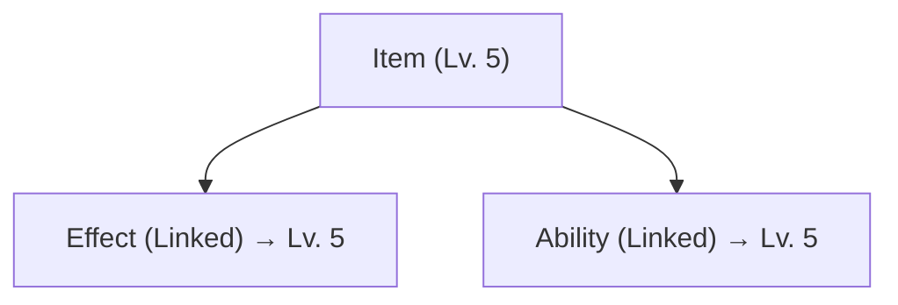

# Items

**Items** are containers that group effects and abilities. They represent equipment, consumables, and collectibles.

## Overview

An item can provide:

- **Passive Effects** — Applied while equipped
- **Active Effects** — Applied on use
- **Abilities** — Granted while equipped
- **Level Scaling** — Act as level provider

## Creating Items

1. **Create > PlayForge > Item**
2. Configure:

```yaml
Name: "Flaming Sword"
Asset Tag: Item.Weapon.Sword.Fire
Context Tags: [Equipment.Weapon.Melee, Element.Fire]

Starting Level: 1
Max Level: 10
```

## Passive Effects

Applied while equipped:

```yaml
Passive Effects:
  - Effect_Sword_AttackBonus   # +15 Attack
  - Effect_Sword_FireDamage    # +10 Fire damage
```

These are typically `Infinite` duration effects.

## Active Effects

Applied on use (consumables):

```yaml
Active Effects:
  - Effect_Potion_Heal  # +50 Health
```

## Granted Abilities

```yaml
Abilities:
  - Ability: Ability_FlameStrike
    Link Mode: LinkedToProvider  # Uses item's level
```

## Level Linking

Items act as level providers:



## Equipment Integration

```csharp
public void EquipItem(Item item)
{
    // Apply passive effects
    foreach (var effect in item.PassiveEffects)
    {
        var spec = _abilitySystem.GenerateEffectSpec(null, effect);
        _abilitySystem.ApplyGameplayEffect(spec);
    }
    
    // Grant abilities
    foreach (var ability in item.Abilities)
        _abilitySystem.GrantAbility(ability.Ability, ability.Level);
}

public void UnequipItem(Item item)
{
    // Remove passive effects
    foreach (var effect in item.PassiveEffects)
        _abilitySystem.RemoveGameplayEffect(effect);
    
    // Remove abilities
    foreach (var ability in item.Abilities)
        _abilitySystem.RemoveAbility(ability.Ability);
}
```

## Common Item Types

### Weapon
```yaml
Name: "Blazebringer"
Passive Effects: [AttackBonus, FireDamage]
Abilities: [FlameStrike]
```

### Consumable
```yaml
Name: "Health Potion"
Max Stack: 99
Active Effects: [Heal_50]
```

### Armor
```yaml
Name: "Dragon Plate"
Passive Effects: [DefenseBonus, FireResist]
```
