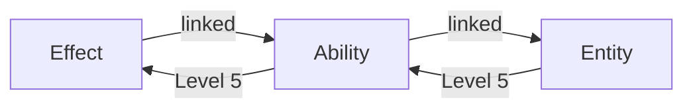

# Scalers

**Scalers** define how values change based on level. They enable dynamic, level-scaling attributes, effects, durations, and magnitudes.

## Overview

Instead of static values, scalers compute values at runtime:

```csharp
public interface IAttributeScaler
{
    float GetValueAtLevel(int level);
}
```

```yaml
# Static
Magnitude: 50

# Scaled
Magnitude: 10
Real Magnitude: Add Scaler
Magnitude Scaler: LinearScaler (10 → 100)

# Result at Level 5: 10 + 55 = 65
```

## Scaler Types

| Type | Use Case |
|------|----------|
| **Simple** | Discrete level values |
| **Linear** | Even progression |
| **Curve** | Custom progression shape |
| **Formula** | Mathematical expressions |
| **Cached Attribute** | Derive from another attribute |

## Simple Scaler

Explicit values per level:

```yaml
Type: SimpleScaler
Level Values: [10, 15, 22, 30, 40]
```

| Level | Value |
|-------|-------|
| 1 | 10 |
| 2 | 15 |
| 3 | 22 |
| 4 | 30 |
| 5 | 40 |

Best for hand-tuned progressions.

## Linear Scaler

Even interpolation between start and end:

```yaml
Type: LinearScaler
Start Value: 10
End Value: 100
Min Level: 1
Max Level: 10
```

**Formula:** `start + (end - start) × ((level - min) / (max - min))`

| Level | Value |
|-------|-------|
| 1 | 10 |
| 5 | 50 |
| 10 | 100 |

## Curve Scaler

Use AnimationCurve for custom shapes:

```yaml
Type: CurveScaler
Curve: [Custom AnimationCurve]
Min Value: 0
Max Value: 100
Min Level: 1
Max Level: 20
```

**How it works:**

1. Normalize level to 0-1: `t = (level - min) / (max - min)`
2. Evaluate curve at `t`
3. Interpolate: `minValue + (maxValue - minValue) × curveValue`

Common curve shapes:

- **Linear** — Straight line
- **Ease In** — Slow start, fast end
- **Ease Out** — Fast start, slow end
- **S-Curve** — Slow-fast-slow

## Formula Scaler

Mathematical expressions using `level`:

```yaml
Type: FormulaScaler
Formula: "10 + level * 5"
Min Level: 1
Max Level: 10
```

### Supported Operations

| Operation | Syntax |
|-----------|--------|
| Add | `level + 10` |
| Subtract | `100 - level` |
| Multiply | `level * 5` |
| Divide | `level / 2` |
| Power | `level ^ 2` |
| Sqrt | `sqrt(level)` |
| Floor | `floor(level / 5)` |
| Ceiling | `ceil(level / 3)` |
| Min | `min(level * 2, 100)` |
| Max | `max(level - 5, 1)` |

### Examples

**Quadratic:**
```yaml
Formula: "10 + level ^ 2"
# Level 1: 11, Level 5: 35, Level 10: 110
```

**Diminishing Returns:**
```yaml
Formula: "50 + sqrt(level) * 20"
# Level 1: 70, Level 25: 150, Level 100: 250
```

**Capped:**
```yaml
Formula: "min(level * 10, 200)"
# Level 15: 150, Level 25: 200 (capped)
```

## Cached Attribute Scaler

Derive value from another attribute:

```yaml
Type: CachedAttributeScaler
Capture Attribute: Strength
Operation: Multiply
Magnitude: 8
```

**Example:** Health scales with Strength

```yaml
Attribute: Health
Base Value: 100
Scaler:
  Type: CachedAttributeScaler
  Capture Attribute: Strength
  Operation: Add
  Magnitude: 10
  
# If Strength = 15: Health = 100 + (15 × 10) = 250
```

### Operations

| Operation | Formula |
|-----------|---------|
| `Add` | base + (attr × magnitude) |
| `Multiply` | base × (attr × magnitude) |
| `Override` | attr × magnitude |

## Using Scalers

### In Attribute Sets

```yaml
Attribute: Health
Base Value: 100
Real Magnitude: Add Scaler
Level Scaler:
  Type: LinearScaler
  Start Value: 0
  End Value: 400
  
# Level 1: 100, Level 10: 500
```

### In Effects

**Duration Scaling:**
```yaml
Duration: 5.0
Real Duration: Add Scaler
Duration Scaler:
  Type: SimpleScaler
  Level Values: [0, 1, 2, 3, 4]
  
# Level 1: 5s, Level 5: 9s
```

**Magnitude Scaling:**
```yaml
Magnitude: -20
Real Magnitude: Multiply with Scaler
Magnitude Scaler:
  Type: LinearScaler
  Start Value: 1.0
  End Value: 2.5
  
# Level 1: -20, Level 10: -50
```

### In Abilities

**Cooldown Reduction:**
```yaml
Cooldown Effect:
  Duration: 10.0
  Real Duration: Multiply with Scaler
  Duration Scaler:
    Type: LinearScaler
    Start Value: 1.0
    End Value: 0.5
    
# Level 1: 10s, Level 10: 5s
```

## Scaler Operations

When applying scalers, choose how the scaled value combines:

| Operation | Formula |
|-----------|---------|
| `Add Scaler` | base + scaler |
| `Multiply with Scaler` | base × scaler |
| `Override with Scaler` | scaler |

## Level Providers

Scalers need a level source. Assets can:

1. **Use own level** — Asset's MinLevel/MaxLevel range
2. **Link to provider** — Use another asset's level



See [Linked Providers](../how-to/linked-providers.md) for details.

## Creating Custom Scalers

Extend `AbstractAttributeScaler`:

```csharp
[Serializable]
public class ExponentialScaler : AbstractAttributeScaler
{
    public float BaseValue = 10f;
    public float GrowthRate = 1.5f;
    
    public override float GetValueAtLevel(int level)
    {
        return BaseValue * Mathf.Pow(GrowthRate, level - 1);
    }
}
```

## Best Practices

| Do | Don't |
|----|-------|
| Use Simple for hand-tuned values | Overcomplicate with formulas |
| Use Linear for even progression | Forget min/max level bounds |
| Use Curve for designer control | Ignore edge cases (level 0) |
| Test at multiple levels | Only test at level 1 |