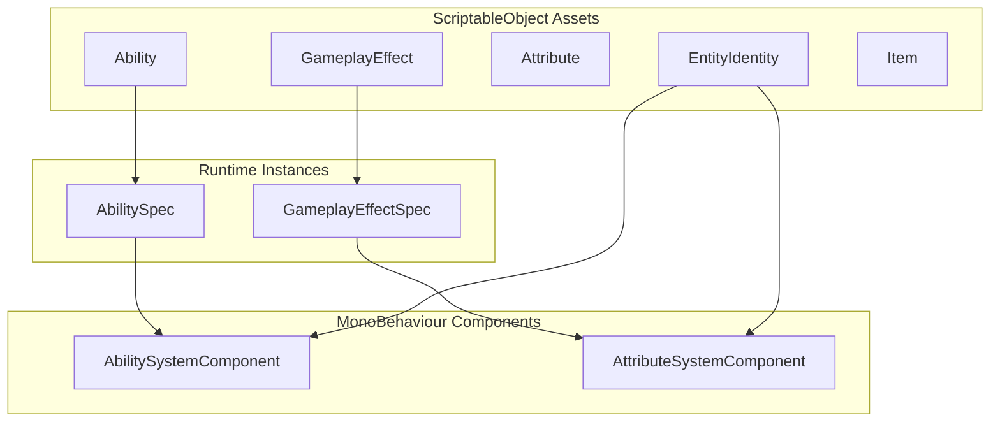

# PlayForge GAS

**PlayForge** is a comprehensive Gameplay Ability System (GAS) framework for Unity, inspired by Unreal Engine's GAS architecture. It provides a data-driven, designer-friendly approach to implementing abilities, attributes, effects, and complex game mechanics.

<div class="feature-grid" markdown>

<div class="feature-card" markdown>
### :zap: Abilities
Define complex multi-stage abilities with targeting, costs, cooldowns, and conditional execution through a flexible task-based system.
</div>

<div class="feature-card" markdown>
### :bar_chart: Attributes
Powerful attribute system with base/current values, derivations, constraints, and level-based scaling.
</div>

<div class="feature-card" markdown>
### :sparkles: Effects
Instant, durational, and infinite effects with stacking, periodic ticks, and conditional application.
</div>

<div class="feature-card" markdown>
### :label: Tags
Hierarchical tag system for requirements, granted effects, and complex conditional logic without code.
</div>

</div>

---

## Quick Start

```csharp
// Grant an ability to an entity
abilitySystem.GrantAbility(fireballAbility, level: 1);

// Activate the ability
if (abilitySystem.TryActivateAbility(fireballAbility, out var proxy))
{
    Debug.Log("Fireball activated!");
}
```

```csharp
// Apply a gameplay effect
var spec = source.GenerateEffectSpec(origin, poisonEffect);
target.ApplyGameplayEffect(spec);
```

[Get Started :material-arrow-right:](getting-started/index.md){ .md-button .md-button--primary }
[View API Reference](api/index.md){ .md-button }

---

## Architecture Overview



---

## Key Features

| Feature | Description |
|---------|-------------|
| **Data-Driven** | Define everything as ScriptableObjects—no code required for content |
| **Level Scaling** | Built-in scalers for level-based attribute and effect scaling |
| **Tag System** | Hierarchical tags for requirements, status effects, and categorization |
| **Async Abilities** | UniTask-based ability execution with full cancellation support |
| **Workers** | Extensible worker system for custom effect and entity behavior |
| **Editor Tools** | PlayForge Manager for asset management, validation, and analysis |

---

## Requirements

- Unity 2021.3 LTS or newer
- UniTask 2.0+

---

## Installation

=== "Git URL"
    ```
    https://github.com/gabedvdsn/PlayForge.git
    ```

=== "Manual"
    Download the latest release and import into your Assets folder.

[Full Installation Guide :material-arrow-right:](getting-started/installation.md)
