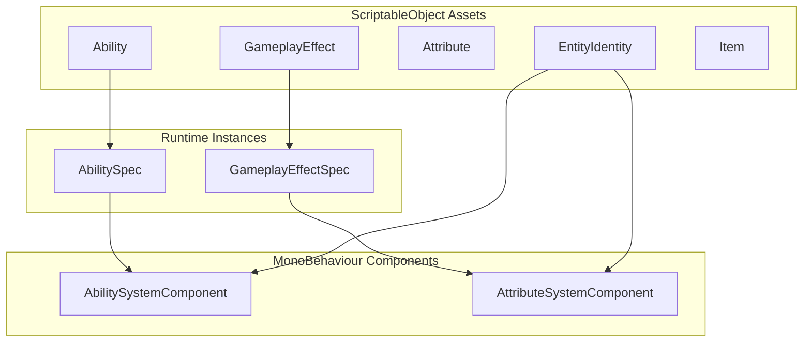

# PlayForge GAS

**PlayForge** is a comprehensive Gameplay Ability System (GAS) framework for Unity, inspired by Unreal Engine's GAS architecture. It provides a data-driven, designer-friendly approach to implementing abilities, attributes, effects, and complex game mechanics.

<div class="feature-grid" markdown>

<div class="feature-card" markdown>
### :zap: Abilities
Define complex multi-stage abilities with targeting, cost, cooldown, and conditional execution through a flexible task-based system.
</div>

<div class="feature-card" markdown>
### :bar_chart: Attributes
Powerful attribute system with base/current values, derivations, constraints, and scaling.
</div>

<div class="feature-card" markdown>
### :sparkles: Effects
Instant, durational, and infinite effects with ticks, stacking, and conditional settings.
</div>

<div class="feature-card" markdown>
### :label: Tags
Hierarchical tag system for requirements, granted resources, and complex conditional logic without code.
</div>

<div class="feature-card" markdown>
### :label: Entities
Encapsulate attribute-based characters with abilities, items, and the logic to handle it.
</div>

<div class="feature-card" markdown>
### :label: Items
Define items and their behaviour, granted effects, and parameterize how your entities handle them.
</div>

<div class="feature-card" markdown>
### :label: Workers
Modular components that extend asset-based behaviour with custom logic.
</div>

</div>

**PlayForge** also offers the **Forge**, a custom editor window designed to optimize the design and development workflow. Whereas **PlayForge** refers to the framework as a whole, **Forge** refers to the variety of included custom editor tooling. Additionally, **Process Control** is a singleton manager designed to store and regulate Monobehaviour processes (and instanced processes).

<div class="feature-grid" markdown>

<div class="feature-card" markdown>
### :label: Forge
Custom editor for creating, viewing, and analysing the balance and complexity of your project.
</div>

<div class="feature-card" markdown>
### :label: Process Control
Custom process handling singleton for precise control over Monobehaviour objects and efficient use of Unity's update timings.
</div>

</div>

---

## Quick Start

```csharp
// Grant an ability to an entity
abilitySystem.GrantAbility(fireballAbility, level: 1);

// Activate the ability
if (abilitySystem.TryActivateAbility(fireballAbility, out var proxy))
{
    Debug.Log("Fireball activated!");
}
```

```csharp
// Apply a gameplay effect
var spec = source.GenerateEffectSpec(origin, poisonEffect);
target.ApplyGameplayEffect(spec);
```

[Get Started :material-arrow-right:](getting-started/index.md){ .md-button .md-button--primary }
[View API Reference](api/index.md){ .md-button }

---

## Architecture Overview



---

## Key Features

| Feature             | Description                                                            |
|---------------------|------------------------------------------------------------------------|
| **Data-Driven**     | Define everything as ScriptableObjects—no code required for content    |
| **Level Scaling**   | Built-in scalers for level-based attribute and effect scaling          |
| **Tag System**      | Hierarchical tags for requirements, status effects, and categorization |
| **Async Abilities** | UniTask-based ability execution with full cancellation support         |
| **Workers**         | Extensible worker system for custom effect and entity behavior         |
| **Forge**           | PlayForge custom Editor for asset management, validation, and analysis |
| **Runtime Tools**   | Runtime-only tools for debugging GAS systems and processes             |

---

## Requirements

- Unity 2021.3 LTS or newer
- UniTask 2.0+

---

## Installation

=== "Git URL"
    ```
    https://github.com/gabedvdsn/PlayForge.git
    ```

=== "Manual"
    Download the latest release and import into your Assets folder.

[Full Installation Guide :material-arrow-right:](getting-started/installation.md)
